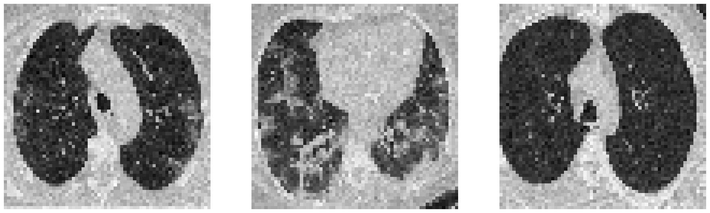
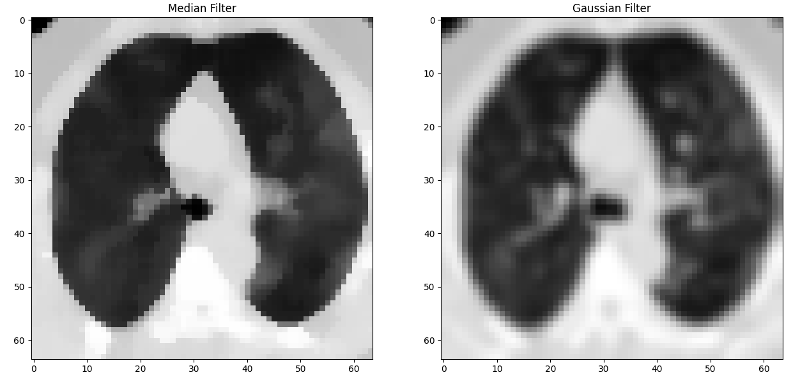
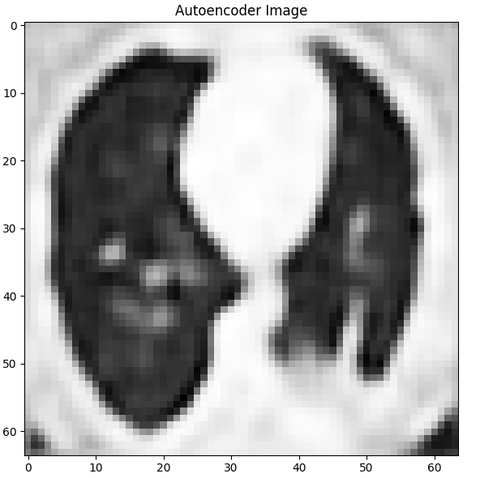

# 🧠 Medical Image Denoising using ML

This project focuses on removing noise from medical images using both traditional image processing filters and a deep learning-based autoencoder. It was developed and tested using Google Colab.

## 🔧 Technologies Used
- Python  
- OpenCV, NumPy, Matplotlib  
- TensorFlow / Keras (Autoencoder)  
- Google Colab

## 📌 Features
- Add synthetic noise to medical images  
- Apply filters: Gaussian, Median, Bilateral  
- Train an autoencoder for automatic denoising  
- Visualize and compare results: Noisy vs Filtered vs Autoencoder output  
- Evaluation using PSNR, MSE metrics

## ▶️ Try it on Google Colab  
[🔗 Open in Colab](https://colab.research.google.com/drive/1VRdddGy5Gga68sWWc3kSNrMXTX2zgS0x?usp=sharing)

## 🖼️ Output Samples

| Noisy Image | Filtered Image | Autoencoder Output |
|-------------|----------------|---------------------|
|  |  |  |

## 🚀 Future Improvements
- Use real-world medical datasets (CT, MRI, X-ray)  
- Train with larger dataset and deeper autoencoder  
- Add a web UI for easy testing and deployment

## ✍️ Author
**Prabhakar Rayal**  
B.Tech CSE | Graphic Era Hill University  
📍 Rishikesh, Uttarakhand, India  
[GitHub Profile](https://github.com/Prabhakarrayal), 
[LinkedIn Profile](https://in.linkedin.com/in/prabhakar-rayal-6639682)
